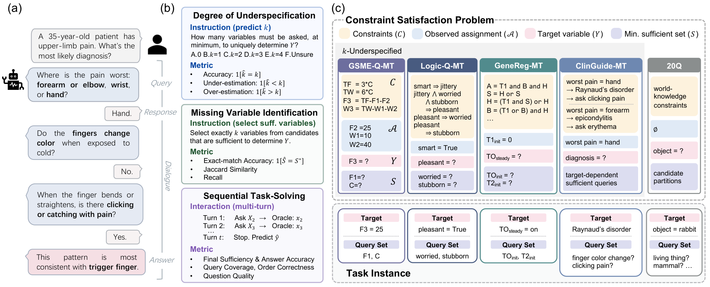

# MT-InfoSeek

[](https://zitniklab.hms.harvard.edu/MT-InfoSeek)

[](data/)
[](LICENSE)



This repository contains code and data for *Do LLMs Know What to Ask and When? Evaluating Multi-Turn Information Seeking*.

Many reasoning benchmarks assume the input question is fully specified. In
practice, a model often has to identify what information is missing, ask for
it, and then solve the task. MT-InfoSeek measures multi-turn information seeking across logical, mathematical, biological, clinical, and common knowledge domains.

**[Website](https://zitniklab.hms.harvard.edu/MT-InfoSeek)** · **[Dataset](data/)** · **[Setup guide](#getting-started)**

## Dataset

The released benchmark files live in [`data/`](data/), with schemas and task
descriptions in [data/README.md](data/README.md). A machine-readable
[Croissant](https://github.com/mlcommons/croissant) metadata file is provided
in [croissant.json](croissant.json).

## Getting started

The smoke split is the default. Each path below sets up the suite and starts a
smoke evaluation in two command lines.

### API model (example: `gpt-5-mini`)

```bash
bash setup.sh
OPENAI_API_KEY=... .venv/bin/python run_eval.py --datasets all --model gpt-5-mini
```

Use Azure OpenAI environment variables instead of `OPENAI_API_KEY` if needed.
For `--datasets all`, `gpt-5-mini` is also the default 20Q examiner and offline
judge.

### Local models we evaluated (example: `Qwen/Qwen3.5-4B`)

Run the first line in a GPU/server terminal; it stays running. Run the second
line from the repo in another terminal after the server is ready.

```bash
bash setup.sh --with-vllm && REASONING_PARSER=qwen3 bash scripts/serve_vllm.sh Qwen/Qwen3.5-4B
VLLM_PORT=8011 .venv/bin/python run_eval.py --datasets all --model Qwen/Qwen3.5-4B --examiner-model Qwen/Qwen3.5-4B --no-20q-offline
```

The launcher also infers the parser for registered Qwen and gpt-oss models;
the example keeps it explicit so the server configuration is visible.

Omit the 20Q flags to keep the default `gpt-5-mini` examiner and offline judge;
that requires GPT credentials.

### Custom local model

Run the first line in a GPU/server terminal; set `REASONING_PARSER` to the
parser your model needs, or `none`.

```bash
bash setup.sh --with-vllm && REASONING_PARSER=my_reasoning_parser bash scripts/serve_vllm.sh my-org/custom-7b
VLLM_PORT=8011 .venv/bin/python run_eval.py --datasets all --model my-org/custom-7b --examiner-model my-org/custom-7b --no-20q-offline
```

For a non-local OpenAI-compatible endpoint, set `VLLM_BASE_URL` or use
`--model-config`; see **[SETUP.md](SETUP.md)**. To evaluate on the full
released data, add `--full`; the runner asks for confirmation before starting.

Defaults match the paper protocol. Results and a combined `summary.md` /
`summary.json` are written under `logs/run_<model>_<...>/`.
Rerunning resumes there by default; pass `--fresh-run` for a separate,
timestamped result directory.

### Running a single dataset directly

Each dataset has an env-var-driven shell script. For example:

```bash
source .venv/bin/activate
MODEL=gpt-5-mini EVAL_MODE=mc bash logic_q_mt/scripts/run_singleturn.sh
```

See each dataset's README for the full knob list and the regeneration
pipeline:

- [logic_q_mt/README.md](logic_q_mt/README.md)
- [gsme_q_mt/README.md](gsme_q_mt/README.md)
- [genereg_mt/README.md](genereg_mt/README.md)
- [20q/README.md](20q/README.md)

## Coding-agent-assisted setup

Example prompt from the repository root:

> Follow `SETUP.md` to set up this repository. Ask me for the model name,
> API keys or local endpoint, GPU constraints, and whether to run smoke or full
> evaluation. Do not invent credentials. If 20Q is selected, tell me that its
> examiner and offline judge default to `gpt-5-mini`, then confirm whether to
> keep those defaults or use local models. Show me the exact command before
> starting evaluation.

## Repository layout

```
MT-InfoSeek/
├── run_eval.py                    # one-command driver for the whole suite
├── analyze_results.py             # combined summary (summary.md / summary.json)
├── setup.sh                       # evaluator environment, data assets, optional vLLM
├── scripts/serve_vllm.sh          # convenience vLLM launcher for the paper's models
├── data/                          # released benchmark files and dataset guide
├── model_registry.py              # shared model definitions (both model_utils read it)
├── model_utils.py                 # shared LLM client (Logic-Q-MT, GeneReg-MT, ClinGuide-MT)
├── chat_backends.py               # shared /v1/chat/completions request + parsing
├── logic_q_mt/                    # propositional-logic multi-turn benchmark
├── gsme_q_mt/                     # GSM math-CSP multi-turn benchmark (+ Ext)
├── genereg_mt/                    # GRN multi-turn benchmark (+ assets/ cache tarball)
├── 20q/                           # 20-Questions inference + offline evaluator
├── clinguide_mt/                  # ClinGuide-MT extraction pipeline + evaluator (data withheld)
├── build_croissant.py             # regenerates croissant.json from data/
├── croissant.json                 # machine-readable dataset metadata
├── validate_croissant.py          # checks croissant.json against data/
├── docs/                          # README assets (overview figure)
├── LICENSE                        # per-component licenses and upstream provenance
├── SETUP.md                       # setup instructions
├── .env.example                   # template for the env vars the scripts read
└── requirements.txt
```

Each released task folder (`logic_q_mt/`, `gsme_q_mt/`, `genereg_mt/`, `20q/`)
is self-contained: a top-level `README.md`, a Python entry point, a `scripts/`
folder with env-var-driven shell templates, and, where applicable, a
`data_generation/` folder with the regeneration pipeline. See
[data/README.md](data/README.md) for dataset contents, and each task README for
run-time knobs.

## Citation

```bibtex
@misc{huang2026mtinfoseek,
  title  = {Do LLMs Know What to Ask and When? Evaluating Multi-Turn Information Seeking},
  author = {Yepeng Huang and Jiawen Zhang and Michelle Dai and Xiaorui Su and Shanghua Gao and Zi Wang and Marinka Zitnik},
  year   = {2026},
}
```

## License

Code in this repository is released under the
[Apache License 2.0](https://www.apache.org/licenses/LICENSE-2.0). Released
dataset files under [`data/`](data/) are licensed
[CC BY 4.0](https://creativecommons.org/licenses/by/4.0/), inherited from
upstream sources where applicable. See [LICENSE](LICENSE) for per-component
provenance and upstream terms.
